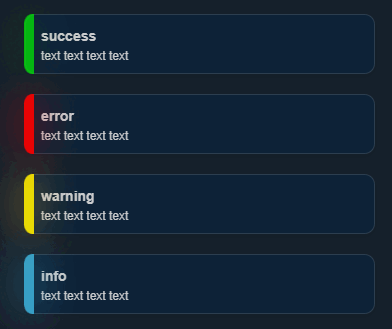

# notifly 
<div align="center">

</div>

## Usage

```javascript
notify({
    type: "warning", //alert | success | error | warning | info
    title: "Alert",
    message: "Notify.js Demo. Super simple Notify plugin.",
    position: {
        x: "right", //right | left | center
        y: "top" //top | bottom | center
    },
    icon: '', //<i>
    size: "normal", //normal | full | small
    overlay: false, //true | false
    closeBtn: true, //true | false
    overflowHide: false, //true | false
    spacing: 20, //number px
    theme: "dark", // dark
    autoHide: false, //true | false | number ms
    onShow: null, //function
    onClick: null, //function
    onHide: null, //function
});
```

